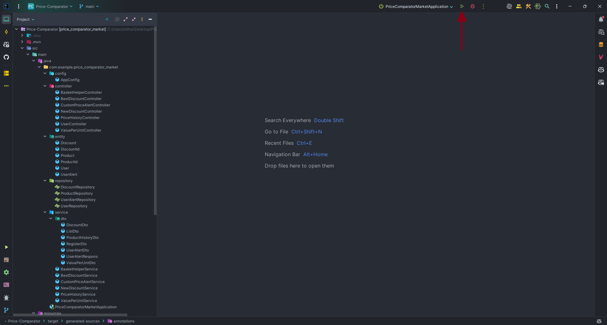
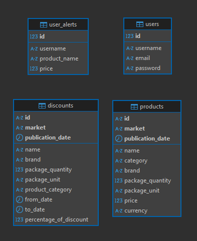

# Price-Comparator

Acest proiect propune o solutie pentru backend-ul unei aplicatii "Price Comparator - Market". Aceasta aplicatie vine in ajutorul utilizatorilor pentru compararea preturilor anumitor produse din diferite lanturi de supermarket-uri. Aplicatia permite utilizatorilor sa gaseasa cea mai buna oferta, sa urmareasca preturile anumitor produse, ba chiar sa isi imparta lista de cumparaturi in functie de pretul produselor pentru a diminua costul total.

## Cuprins

- [Rulare](#rulare)
- [Utilizare](#utilizare)
- [Functionalitati](#functionalitati)
- [Structura baze de date](#structura-bazei-de-date)

## Rulare

Pentru rularea proiectului este necesara instalarea platformei Docker ([ghid instalare](https://docs.docker.com/engine/install/)), iar apoi rularea comenzii ```docker compose up -d``` pentru pornirea container-ului docker ce contine baza de date a aplicatiei. Dupa pornirea container-ului docker, pentru rularea efectiva a aplicatiei, se deschide proiectul in IntelliJ IDEA, si se apasa butonul de run: 

## Utilizare

Aceasta aplicatie poate fi utilizata prin apelarea endpoint-urilor puse la dispozitie aceste sunt :
- http://localhost:8080/api/v1/basket-helper/get/best-list<br>
Exemplu de request:<br>
``` 
GET http://localhost:8080/api/v1/basket-helper/get/best-list
Content-Type: application/json
{
  "products": []
} 
```
- http://localhost:8080/api/v1/best-discount/get<br>
Exemplu de request:<br>
``` 
GET http://localhost:8080/api/v1/best-discount/get 
```
- http://localhost:8080/api/v1/best-discount/get/top/{n}<br>
Exemplu de request:<br>
``` 
GET http://localhost:8080/api/v1/best-discount/get/top/3
```
- http://localhost:8080/api/v1/price-alert/set-alert<br>
Exemplu de request:<br>
``` 
POST http://localhost:8080/api/v1/price-alert/set-alert
Content-Type: application/json
{
  "username": "",
  "productName": "",
  "price": {}
} 
```
- http://localhost:8080/api/v1/price-alert/check-alerts-for/{username}<br>
Exemplu de request:<br>
``` 
GET http://localhost:8080/api/v1/price-alert/check-alerts-for/mihai 
```
- http://localhost:8080/api/v1/new-discount/get<br>
Exemplu de request:<br>
``` 
GET http://localhost:8080/api/v1/new-discount/get
```
- http://localhost:8080/api/v1/new-discount/get/last/{n}/days<br>
Exemplu de request:<br>
``` 
GET http://localhost:8080/api/v1/new-discount/get/last/3/days
```
- http://localhost:8080/api/v1/price-history/getPriceHistory/{n}/days/{productName}<br>
Exemplu de request:<br>
``` 
GET http://localhost:8080/api/v1/price-history/getPriceHistory/5/days/banane
```
- http://localhost:8080/api/v1/user/getUser<br>
Exemplu de request:<br>
``` 
GET http://localhost:8080/api/v1/user/getUser
```
- http://localhost:8080/api/v1/user/register<br>
Exemplu de request:<br>
``` 
POST http://localhost:8080/api/v1/user/register
Content-Type: application/json
{
  "username": "",
  "password": "",
  "email": ""
}
```
- http://localhost:8080/api/v1/user/deleteUser/{id}<br>
Exemplu de request:<br>
``` 
DELETE http://localhost:8080/api/v1/user/deleteUser/2
```
- http://localhost:8080/api/v1/value-per-unit/get-for-product/{productName}<br>
Exemplu de request:<br>
``` 
GET http://localhost:8080/api/v1/value-per-unit/get-for-product/lapte zuzu

```

## Functionalitati

1. Impartirea listei de cumparaturi in liste mai mici per market pentru eficientizarea costului total.

2. Verificarea celor mai bune discaunturi active per market, respectiv obtinerea top n discaunturi active per market.

3. Setarea pretului dorit pentru un produs de catre utilizatori, si verificarea daca preturile dorite de catre utilizator au fost atinse in ziua curenta.

4. Obtinerea celor mai noi discaunturi, cat si obtinerea discaunturilor in ultimele n zile.

5. Obtinerea istoricului de preturi pe care un produs le-a avut in ultimele n zile.

6. Posibilitatea de a vedea toti utilizatorii, de a adauga noi utilizatori si de a sterge utilizatori.

7. Obtinerea unei liste de pret per unitate pe fiecare market pentru un produs.

## Structura bazei de date



Am alez sa folosesc o baza de date PostgreSQL deoarece permite o integrare mult mai buna cu framework-ul SpringBoot, decat folosirea de fisiere CSV.